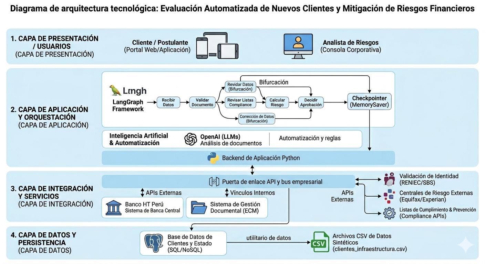
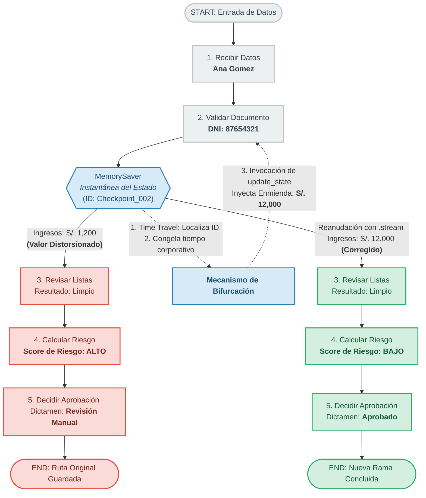

# Proyecto M3: LangGraph: Persistencia, Checkpointing y Rewind
## Desarrollo demo: Sistema de Evaluación Automatizada de Nuevos Clientes y Mitigación de Riesgos Financieros.

> [!Note]
>  Caso seleccionado: Opción _A_, Proceso de _Evaluacion de nuevos clientes_ con capacidad de demostrar _Fork cuando un dato fue corregido_.

## CONTENIDO

[1. DESCRIPCION DEL CASO DE NEGOCIO](#1-descripcion-del-caso-de-negocio)<br>
[2. ARQUITECTURA DETALLADA Y DESCRIPCION DE FLUJOS DEL GRAFO](#2-arquitectura-detallada-y-descripcion-de-flujos-del-grafo)<br>
[3. EXPLICACION DEL ESTADO Y CAMPOS PRINCIPALES](#3-explicacion-del-estado-y-campos-principales)<br>
[4. LISTA DE NODOS Y RESPONSABILIDAD DE CADA UNO](#4-lista-de-nodos-y-responsabilidad-de-cada-uno)<br>
[5. EXPLICACION DE CHECKPOINTS Y THREAD_ID](#5-explicacion-de-checkpoints-y-thread_id)<br>
[6. INSTRUCCIONES DE INSTALACION](#6-instrucciones-de-instalacion)<br>
[7. INSTRUCCIONES DE EJECUCION Y RESULTADO](#7-instrucciones-de-ejecucion-y-resultado)<br>
[8. COMO REPRODUCIR REPLAY, FORK O APROBACION HUMANA SEGUN CORRESPONDA](#8-como-reproducir-replay-fork-o-aprobacion-humana-segun-corresponda)<br>
[9. CAPTURAS O RESUTADOS ESPERADO DE LA DEMO](#9-capturas-o-resutados-esperado-de-la-demo)<br>
[10. PROXIMO PASOS (ROADMAP)](#10-proximo-pasos-roadmap)<br>

*Documentación elaborado por [Hadson Paredes](https://www.linkedin.com/in/hadson-paredes/) - 2026*
- Repositorio [Project-LangGraph-Customer-Evaluation](https://github.com/devhadson/Project-LangGraph-Customer-Evaluation)
- Elaboración: Sistema de Evaluación Automatizada de Nuevos Clientes y Mitigación de Riesgos Financieros
    - Arquitectura: LangGraph aplicando Persistencia, Checkpointing y Rewind de LangChain.
    - Framework: LangChain.
    - Uso de datos: Datos sinteticos
- Especialización: IA Engineer y Arquitetura de Sistemas Generativos 
- Docentee: [Miguel Angel Cotrina Espinoza](https://www.linkedin.com/in/mcotrina/)
- [Instituto de Datos e Inteligencia Artificial - URP](https://www.linkedin.com/company/idia-urp/)

---

# 1. DESCRIPCION DEL CASO DE NEGOCIO

El Banco **"HT Perú"** viene ejecutando un proceso de **Onboarding Digital e Inteligente** para la admisión y evaluación expedita de nuevos clientes que solicitan productos financieros (tales como tarjetas de crédito o préstamos de consumo).

Tradicionalmente, este proceso requería de múltiples mesas de control independientes y validaciones manuales secuenciales que hace que el proceso de aprobación sea lento y engorroso. El nuevo **Sistema** de _Evaluación Automatizada de Nuevos Clientes y Mitigación de Riesgos Financieros_ unifica estas capas de control en un único flujo de trabajo orquestado por un Grafo de Estados (`LangGraph`), permitiendo validar la identidad, analizar antecedentes regulatorios, calcular el riesgo financiero en base a los ingresos reales y determinar un dictamen automático. Su mayor valor diferencial radica en la resiliencia operativa: la capacidad de enmendar errores humanos de digitación mediante un mecanismo de auditoría y "viaje en el tiempo" sin destruir el expediente histórico de la solicitud. 

## 1.1 ACTORES, NECESIDADES Y OBJETIVOS DEL NEGOCIO

En esta sección revisaremos los actores involucrados, necesidades y objetivos del negocio que busca la solución en base a uso y aplicación de componentes de _LangGraph_.

### Actores Involucrados

Dentro de este ecosistema de evaluación automatizada coexisten actores tanto humanos como sistémicos:

* **El Postulante / Nuevo Cliente (Ej: Ana Gómez):** Es la persona natural que inicia la interacción con el banco al solicitar un producto de crédito. Proporciona sus datos identificativos (DNI) y los documentos que sustentan su salud financiera (boletas de pago o recibos por honorarios). Su objetivo es recibir una respuesta de aprobación en el menor tiempo posible.
* **El Operador de Mesa de Control / Analista de Admisión (Usuario Interno):** Personal del banco encargado de la digitación, mesa de partes o la supervisión primaria de los datos capturados en el sistema. Es el actor propenso a cometer errores materiales (como registrar S/. 1,200 en lugar de S/. 12,000) y quien, al detectar la inconsistencia, activa las funciones avanzadas de enmienda en el sistema para corregir el rumbo de la solicitud.
* **El Motor de Riesgo e Integridad Sistémica (LangGraph + MemorySaver):** Es el actor tecnológico central. Actúa como el orquestador inmutable del flujo. Ejecuta de forma determinista las políticas de riesgo del banco, almacena las instantáneas históricas de cada etapa (Checkpoints) y procesa las bifurcaciones (*Forking*) cuando se inyectan datos corregidos.
* **El Oficial de Cumplimiento / Auditor Regulación (Stakeholder de Control):** Actor indirecto que no opera el día a día, pero consume las bitácoras y logs de eventos generados por la aplicación. Su función es garantizar que cada crédito aprobado o rechazado cuente con una pista de auditoría transparente y legal ante entes reguladores (como la SBS).

### Necesidades del Negocio

El diseño de este sistema responde a tres problemáticas críticas detectadas en la operación del banco "HT Perú":

1. **Altas tasas de abandono en el Onboarding:** Los procesos de evaluación tradicionales tardaban días debido a que los datos pasaban por silos informáticos aislados. El banco necesitaba unificar la validación documental, las listas de cumplimiento y el scoring financiero en una sola transacción fluida.
2. **Pérdida de productividad por fricción de errores manuales:** En los sistemas tradicionales, si un analista digitaba mal un salario, la solicitud avanzaba con el error hasta el final, generando un rechazo injustificado. Para corregirlo, el analista debía anular todo, pedirle al cliente volver a llenar los formularios y reiniciar el flujo desde cero, perdiendo tiempo y recursos de infraestructura.
3. **Falta de trazabilidad y "fuga" de auditoría:** Al corregir datos o hacer modificaciones manuales en sistemas antiguos, la información anterior se sobrescribía, perdiéndose el historial de qué analista modificó qué dato, lo cual vulneraba las normativas de cumplimiento de prevención del lavado de activos y transparencia crediticia.

### Objetivos del Negocio con la Solución LangGraph

Al implementar la solución basada en grafos con persistencia transaccional de checkpoints, "HT Perú" proyecta alcanzar los siguientes objetivos estratégicos:

* **Reducir el Time-to-Market de Aprobación:** Lograr un dictamen automatizado en segundos para los clientes cuyos datos estén íntegros, optimizando el desvío de rutas (Bypass) cuando un documento sea inválido para no gastar recursos evaluando listas o ingresos.
* **Cero Deserción por Errores de Captura mediante Forking:** Permitir que si un dato sensible es identificado como erróneo en el tramo medio del flujo (Ej: el ingreso monetario), el sistema pueda **viajar en el tiempo**, aplicar la enmienda exacta sobre el checkpoint intermedio y reanudar el cálculo financiero en una rama paralela. Con esto se rescata la solicitud del cliente de inmediato, transformando un dictamen original de "Revisión Manual/Rechazo" en un veredicto real de "Aprobado".
* **Garantizar Auditoría Regulatoria de Extremo a Extremo:** Almacenar de forma inmutable todas las realidades de la transacción. El banco puede demostrar con la bitácora de eventos integrada que la solicitud tuvo un error inicial, documentar el segundo exacto en que el operador inyectó la corrección y registrar la aprobación en la rama alterna, manteniendo ambas versiones coexistiendo en la base de datos de control para blindaje legal.
* **Eficiencia de Cómputo e Infraestructura:** Evitar el reprocesamiento innecesario. Al usar el método `update_state()` sobre un checkpoint específico, el motor no vuelve a gastar recursos ejecutando los nodos iniciales (como la lectura o validación estructural del DNI), sino que levanta las dependencias a partir del punto exacto de la corrección, disminuyendo los costos operativos de TI.


## 1.2. MANUAL DE POLITICAS DE RIESGO Y OPERACIONES DE CREDITO

### Reglas de Validación Documental
* Todo documento de identidad (DNI o Carné de Extranjería) debe contener exactamente 8 caracteres numéricos.
* Si el documento no pasa la validación de formato, el motor marcará la solicitud como críticamente inválida.
* **Optimización de Ruta:** Ante un error documental severo, el motor omitirá las fases de consulta de ingresos para mitigar costos de procesamiento, saltando directamente al nodo de decisión con estado de rechazo automático.

### Reglas de Control de Cumplimiento (Compliance)
* Se realiza un cruce obligatorio de información contra listas restrictivas de antecedentes (Lavado de Activos, Terrorismo, Fraude Corporativo).
* La existencia de cualquier coincidencia positiva (`Alerta`) anula de forma inmediata cualquier ponderación de riesgo financiero, derivando la solicitud a un estado irreversible de **Rechazado**.

### Matriz de Scoring de Riesgo Financiero
El puntaje interno de riesgo consolidado opera en una escala de `0 (Mínimo Riesgo)` a `100 (Máximo Riesgo)`. Su cálculo se basa en la combinación de los ingresos demostrables mensuales del cliente y su Score Crediticio Externo obtenido de centrales de riesgo:

#### Condición de Score

| Condición de Score | Impacto en Puntos |
| :--- | :--- |
| Score > 700 puntos (Excelente) | Resta 40 puntos de riesgo |
| Score > 550 puntos (Regular) | Resta 20 puntos de riesgo |
| Score <= 550 puntos (Deficiente) | Mantiene base de riesgo |


#### Condición de Ingresos Mensuales

| Condición de Ingresos Mensuales | Impacto en Puntos |
| :--- | :--- |
| Ingresos > S/. 10,000 | Resta 30 puntos de riesgo |
| Ingresos > S/. 4,000 | Resta 15 puntos de riesgo |
| Ingresos <= S/. 4,000 | Mantiene base de riesgo |

### Reglas de Dictamen Final y Límites de Aprobación
* **APROBADO:** Score de riesgo interno menor a `40 puntos` **Y** listas de control `Limpias`.
* **REVISIÓN MANUAL:** Score de riesgo interno igual o mayor a `40 puntos` pero menor a `80 puntos`. Requiere la intervención de un analista senior de créditos.
* **RECHAZADO:** Score de riesgo interno igual o mayor a `80 puntos` **O** presencia de coincidencias en Listas de control (`Alerta`).

### Regla de Auditoría y Correcciones (Time Travel / Forking)
* Si un operador de mesa detecta una digitación errónea en variables sensibles (ingresos, score, número de documento), el sistema prohíbe reiniciar el flujo desde cero para proteger los logs históricos.
* Obligatoriamente se debe localizar el punto de restauración óptimo (Checkpoint posterior a la validación de documentos y previo al motor de riesgo), actualizar el estado con los datos auditados mediante `update_state` y ejecutar un `Fork` para abrir una nueva línea temporal paralela de evaluación.

---

# 2. ARQUITECTURA DETALLADA Y DESCRIPCION DE FLUJOS DEL GRAFO

## 2.1. DIAGRAMA DE ARQUITECTURA TECNOLOGICA EN CAPAS



> [!IMPORTANT]
> Puedes encontrar más detalles sobre su implementación en la documentación [oficial de LangChain](https://docs.langchain.com/langsmith/human-in-the-loop-time-travel). 

El diagrama está estructurado en cuatro capas principales, a continuación se detallan cada capa:

### Capa 1: Presentación / Usuarios
Esta capa define los puntos de acceso para los actores principales identificados en el caso de negocio:

- **Cliente / Postulante:** Accede a través de la aplicación móvil o portal web para iniciar la solicitud de onboarding digital.
- **Analista de Riesgos (Consola Corporativa):** Utiliza una interfaz dedicada para supervisar las solicitudes y gestionar las correcciones de datos materiales.

### Capa 2: Aplicación y Orquestación
Esta es la capa central basada en el framework LangGraph, detallando la lógica de la solución construida:

- **LangGraph Framework:** Muestra el flujo completo del grafo, incluyendo los nodos clave como 'Recibir Datos', 'Validar Documento', y 'Calcular Riesgo', reflejando el algoritmo de scoring de la política de riesgo. Se destaca visualmente la funcionalidad de Bifurcación (Forking) para datos corregidos, que permite el "viaje en el tiempo" sin destruir el historial.
- **IA & Automatización:** Integra OpenAI (LLMs) para el análisis inteligente de documentos (boletas de pago) y un motor de reglas para la automatización de la matriz de decisiones (aprobado, revisión, rechazado).
- **Checkpointer (MemorySaver):** Esencial para la persistencia transaccional y el historial inmutable de cada transacción (thread_id).

### Capa 3: Integración y Servicios
Esta capa de middleware orquesta la comunicación con los sistemas internos y externos del banco:

- **Puerta de enlace API y bus empresarial:** Facilita la interoperabilidad segura.
- **Vínculos Internos:** Conexiones con el Core Banking de Banco HT Perú y el Sistema de Gestión Documental (ECM).
- **APIs Externas:** Integración con RENIEC/SBS para identidad, Equifax/Experian para buró de crédito, y APIs de cumplimiento para listas de control.

### Capa 4: Datos y Persistencia
Esta capa final garantiza la integridad de la información y la auditoría completa:

- **Base de Datos de Clientes y Estado (SQL/NoSQL):** Almacena el expediente del cliente y el estado del grafo en cada checkpoint.
- **Archivos CSV de Datos Sintéticos:** Representa el origen de datos generado por el utilitario de datos, permitiendo la trazabilidad completa desde la entrada inicial hasta el dictamen final, cumpliendo con los objetivos de auditoría y eficiencia operativa.

---

## 2.2. FLUJOS DEL GRAFOS APLICADAS A LA SOLUCION

### DEMOSTRACION Y FLUJO INTEGRAL DE FORKING

#### Análisis de Trazabilidad Demostrativa (Ruta Original vs. Fork)
Al ejecutar la aplicación desarrollada, los logs de la consola empresarial demuestran con precisión matemática la separación y el comportamiento de ambas ramas de ejecución:

1. **La Ruta Original:** Recibe al cliente y evalúa sus ingresos con un valor distorsionado de `S/. 1,200`. Al correr la lógica del nodo `calcular_riesgo`, el sistema penaliza el bajo nivel salarial asignando un Score de Riesgo alto, concluyendo en el nodo `decidir_aprobacion` con un dictamen de **"Revisión Manual"**.

2. **El Viaje en el Tiempo (Time Travel):** Gracias a `MemorySaver`, el sistema extrae el historial del hilo, localiza el ID único del checkpoint guardado exactamente al salir del nodo `validar_documento` y congela el tiempo corporativo.

3. **La Inyección y Bifurcación (Forking):** Se invoca el método `update_state()`, inyectando la corrección de haberes a `S/. 12,000`. Al reanudar el flujo mediante `.stream()`, LangGraph levanta las dependencias pendientes desde ese punto intermedio. El motor recalcula la matriz financiera con la nueva variable limpia, reduciendo el Score de Riesgo drásticamente y emitiendo un nuevo veredicto final de **"Aprobado"**, todo perfectamente documentado y auditado en los logs cronológicos de la transacción sin haber alterado el historial anterior del grafo.

A continuación, presento el flujo detallado que representa visualmente el Análisis de Trazabilidad Demostrativa, ilustrando la separación clara entre la **Ruta Original** (con el error de captura) y la **Nueva Rama (Fork)** tras el Viaje en el Tiempo (*Time Travel*).



##### Puntos Clave del flujo:

* **El Nodo Troncal (`MemorySaver`):** Actúa como el punto de bifurcación crítico. Es el guardián que permite congelar la línea temporal del procesamiento de Ana Gomez.
* **El Camino Rojo (Ruta Original):** Muestra visualmente cómo el dato erróneo (`S/. 1,200`) se propaga linealmente hacia adelante, castigando el score crediticio interno y forzando una intervención manual indeseada.
* **El Camino Verde (Nueva Rama / Fork):** Grafica la reanudación paralela desde el punto exacto de la enmienda. El sistema levanta las dependencias pendientes de manera aislada, recalculando la matriz con los `S/. 12,000` reales y logrando la aprobación automática sin alterar los logs de auditoría de la primera ejecución.


Para elevar el nivel de la demostración al estándar de una arquitectura de producción y permitirte ejecutar las pruebas de manera independiente sin colisiones de estado, he reestructurado la solución en un **ecosistema de archivos separados**.

A continuación, encontrarás el diseño de la arquitectura de archivos, el código detallado de cada componente y la guía técnica paso a paso para ejecutar y auditar el comportamiento de **Time Travel** y **Forking** en LangGraph.

El **Análisis de Trazabilidad Demostrativa** para el Caso 2 (`case_time_travel_fork.py`) constituye el núcleo de auditoría y control de procesos en arquitecturas basadas en grafos de estado persistentes. A continuación, se detalla un desglose técnico, matemático y procedimental de cómo interactúan ambas ramas de ejecución en la memoria del sistema utilizando el framework **LangGraph**.

---

### ANALISIS DE TRAZABILIDAD DEMOSTRATIVA

El **Análisis de Trazabilidad Demostrativa** es la auditoría técnica que demuestra cómo el framework LangGraph gestiona estados inmutables, persistencia basada en checkpoints y bifurcaciones temporales (*Forking*) sin alterar el historial transaccional original.

A continuación, se detalla paso a paso el comportamiento matemático y lógico de la memoria al ejecutar consecutivamente `case_original_error.py` y `case_time_travel_fork.py`.


#### 1. Cronología de la Memoria y Estados (Thread: `TRANSACCION_ANA_GOMEZ`)

Cuando trabajamos con sistemas financieros o de evaluación de riesgo, no podemos permitir que los datos se sobrescriban destructivamente. LangGraph soluciona esto guardando una instantánea (*Snapshot*) cada vez que un nodo termina su ejecución.

A nivel interno, el `MemorySaver` organiza la línea de tiempo de la cliente **Ana Gómez** a través de las siguientes fases secuenciales:

##### Fase A: La Ruta Original (`case_original_error.py`)

En esta primera fase, el operador ingresa por error un salario menor al real. El grafo avanza de forma estrictamente lineal:

1. **Estado Inicial ($S_0$):** Se cargan los datos crudos extraídos del archivo CSV utilitario (`data_engine.py`).

$$\text{ingresos\_mensuales} = 1,200 \quad | \quad \text{score\_externo} = 720$$


2. **Nodo: `recibir_datos` $\rightarrow$ Checkpoint 1 ($CP_1$):**
El estado se registra en la base de datos de memoria asociada al identificador único `TRANSACCION_ANA_GOMEZ`.
3. **Nodo: `validar_documento` $\rightarrow$ Checkpoint 2 ($CP_2$):**
Se valida el DNI (`87654321`), el cual es correcto (8 dígitos numéricos). El estado guarda la bandera `documento_valido = True`. **Este punto se convierte en nuestro hito de restauración.**
4. **Nodo: `revisar_listas` $\rightarrow$ Checkpoint 3 ($CP_3$):**
Se verifica la base de datos de cumplimiento. Resultado: `Limpio`.
5. **Nodo: `calcular_riesgo` $\rightarrow$ Checkpoint 4 ($CP_4$):**
El motor aplica las reglas en markdown. Al evaluar un ingreso de solo S/. 1,200, el sistema no otorga ningún beneficio financiero.

$$\text{Base Riesgo (100)} - \text{Deducción Score Ext (40)} - \text{Deducción Ingresos (0)} = 60 \text{ puntos}$$


6. **Nodo: `decidir_aprobacion` $\rightarrow$ Estado Final Original ($S_{final\_orig}$):**
Al encontrarse el riesgo en el rango de $40 \le \text{Score} < 80$, la matriz dictamina de forma estricta: **"Revisión Manual"**. El flujo llega a `END`.


##### Fase B: El Viaje en el Tiempo (*Time Travel*)

Al iniciar `case_time_travel_fork.py`, el sistema ejecuta una inspección retrospectiva invocando la función `app_evaluacion.get_state_history()`.

La consola empresarial analiza el árbol de checkpoints de atrás hacia adelante:


$$\{CP_4 \rightarrow CP_3 \rightarrow \mathbf{CP_2} \rightarrow CP_1\}$$

El algoritmo busca un estado donde el DNI ya esté validado pero los cálculos financieros aún no hayan comenzado. Localiza con precisión matemática el **$CP_2$** (cuya propiedad `next` apunta a ejecutar el nodo `revisar_listas`). En ese instante, el sistema "congela" el tiempo para ese ID de transacción, aislando sus variables.


##### Fase C: La Inyección y Bifurcación (*Forking*)

Una vez posicionados en el pasado de la transacción ($CP_2$), se ejecuta el método fundamental de LangGraph: `update_state()`.

```python
app_evaluacion.update_state(config_fork, valores_modificables, as_node="validar_documento")

```

1. **Inmutabilidad preservada:** LangGraph no borra las fotos de los checkpoints $CP_3$ o $CP_4$ de la ruta original. En su lugar, crea un **punto de ramificación** adjunto a $CP_2$.
2. **Inyección de datos:** El valor de `ingresos_mensuales` se modifica directamente en el diccionario de memoria de `1,200` a `12,000`. Se añade un log de auditoría al arreglo de `eventos`.
3. **Reanudación del flujo (.stream):** Al invocar el procesamiento pasando la configuración del checkpoint clonado, el motor de LangGraph no inicia desde `START`. Sabe exactamente que el camino pendiente tras `validar_documento` es `revisar_listas`.

A partir de aquí, se genera la **Nueva Rama (Fork)**:

* **Nodo: `revisar_listas` (Rama Fork):** Se vuelve a procesar de forma aislada. Resultado: `Limpio`.
* **Nodo: `calcular_riesgo` (Rama Fork):** El motor financiero vuelve a evaluar las variables, pero ahora cuenta con el dato correcto.

$$\text{Base Riesgo (100)} - \text{Deducción Score Ext (40)} - \text{Deducción Ingresos (30)} = 30 \text{ puntos}$$


* **Nodo: `decidir_aprobacion` (Rama Fork):** Al ser el score de riesgo de 30 puntos (menor al umbral de 40), el sistema emite el nuevo dictamen: **"Aprobado"**.


#### 2. Cuadro Comparativo de Trazabilidad Monetaria y Logística

El resultado de ambos scripts demuestra que un solo hilo de conversación (`thread_id`) puede contener múltiples realidades históricas coexistiendo en la base de datos de persistencia:

| Métrica / Atributo | Ruta Original (`case_original_error.py`) | Nueva Rama (`case_time_travel_fork.py`) |
| --- | --- | --- |
| **Ingreso Mensual Evaluado** | S/. 1,200 *(Captura defectuosa)* | **S/. 12,000** *(Valor real auditado)* |
| **Score de Riesgo Asignado** | 60 puntos *(Riesgo Moderado-Alto)* | **30 puntos** *(Riesgo Mínimo)* |
| **Dictamen de Salida** | 🛑 **Revisión Manual** | ✅ **Aprobado** |
| **Estado del Historial** | Almacenado de forma íntegra para auditoría. | Ramificado desde el Checkpoint 2. |
| **Trazabilidad en Log** | Muestra el recorrido limpio lineal. | Muestra el origen original, el evento `--- BIFURCACIÓN EJECUTADA ---` y el recálculo. |

#### 3. Conclusión de la Demostración Técnica

Este análisis demuestra que la arquitectura basada en LangGraph cumple con los más altos estándares de desarrollo de software para el sector bancario y de seguros:

* **Auditoría Completa:** Ningún dato se pierde. Si un regulador o un auditor consulta la historia del crédito de Ana Gómez, podrá ver el error humano cometido originalmente, quién aplicó la corrección, en qué segundo exacto se bifurcó el flujo y el motivo por el cual la rama alterna cambió el estatus a aprobado.
* **Eficiencia de Cómputo:** El viaje en el tiempo no requirió volver a ejecutar el Nodo 1 (`recibir_datos`). El grafo reanudó operaciones directamente en la sección intermedia donde se requería el procesamiento, optimizando los recursos de infraestructura.

### FLUJO SECUENCIAL Y LOGICO DETALLADO

A continuación, presento el flujo secuencial y lógico detallado de acuerdo al diseñado implementado. Se detalla con precisión los valores en base a las tres fases analizadas (**Ruta Original**, **Viaje en el Tiempo** e **Inyección/Bifurcación**) manteniendo la coherencia de variables y nomenclatura exacta de los scripts desarrollados:

```mermaid
graph TD
    %% ========================================================
    %% CONFIGURACIÓN DE ESTILOS Y CLASES
    %% ========================================================
    classDef clase_inicio fill:#2c3e50,stroke:#1a252f,stroke-width:2px,color:#ffffff;
    classDef clase_comun fill:#eaeded,stroke:#95a5a6,stroke-width:2px,color:#2c3e50;
    classDef clase_original fill:#fce4d6,stroke:#e67e22,stroke-width:2px,color:#7e5109;
    classDef clase_fork fill:#e8f8f5,stroke:#1abc9c,stroke-width:2px,color:#0e6251;
    classDef clase_checkpoint fill:#eaf2f8,stroke:#2980b9,stroke-width:2px,color:#1b4f72;
    classDef clase_operacion fill:#fef9e7,stroke:#f1c40f,stroke-width:2px,color:#7d6608;

    %% ========================================================
    %% FASE A: LA RUTA ORIGINAL (case_original_error.py)
    %% ========================================================
    subgraph SUB_FASE_A ["FASE A: La Ruta Original (case_original_error.py)"]
        S0([Estado Inicial S0 <br> Ingresos: S/. 1,200 <br> Score Ext: 720]) --> CP1
        
        CP1[["recibir_datos <br> (Checkpoint 1: CP1)"]] --> CP2
        
        CP2[["validar_documento <br> (Checkpoint 2: CP2) <br> DNI Valido: True <br> 📌 HITO RESTAURACIÓN"]] --> N3_Orig
        
        N3_Orig["revisar_listas <br> (Checkpoint 3: CP3) <br> Resultado: Limpio"] --> N4_Orig
        
        N4_Orig["calcular_riesgo <br> (Checkpoint 4: CP4) <br> Base 100 - 40 - 0 = 60 pts"] --> N5_Orig
        
        N5_Orig["decidir_aprobacion <br> (S_final_orig) <br> Dictamen: Revisión Manual"] --> END_Orig([END: Flujo Original])
    end

    %% ========================================================
    %% FASE B: EL VIAJE EN EL TIEMPO (Time Travel)
    %% ========================================================
    subgraph SUB_FASE_B ["FASE B: El Viaje en el Tiempo (Time Travel)"]
        B1["app_evaluacion.get_state_history()"] --> B2{"Analiza historial <br> de atrás hacia adelante: <br> CP4 a CP3 a CP2"}
        B2 -->|Localiza punto exacto| B3["Aísla variables de CP2 <br> y congela tiempo corporativo"]
    end

    %% Conexiones lógicas de activación de la Fase B
    N5_Orig -.->|"Detección de Error <br> por Operador"| B1

    %% ========================================================
    %% FASE C: LA INYECCIÓN Y BIFURCACIÓN (case_time_travel_fork.py)
    %% ========================================================
    subgraph SUB_FASE_C ["FASE C: La Inyección y Bifurcación (Forking)"]
        C1["update_state() <br> Inmutabilidad preservada <br> (CP3 y CP4 intactos)"] --> C2["Inyección de Datos: <br> ingresos_mensuales = 12,000 <br> Evento registrado en Log"]
        
        C2 -->|"Reanudación del flujo <br> vía .stream()"| N3_Fork
        
        N3_Fork["revisar_listas (Rama Fork) <br> Resultado: Limpio <br> (Eficiencia: No repite Nodo 1)"] --> N4_Fork
        
        N4_Fork["calcular_riesgo (Rama Fork) <br> Base 100 - 40 - 30 = 30 pts"] --> N5_Fork
        
        N5_Fork["decidir_aprobacion (Rama Fork) <br> Dictamen Final: Aprobado"] --> END_Fork([END: Nueva Rama Concluida])
    end

    %% Conexiones lógicas de activación de la Fase C
    B3 -.->|Direcciona hacia| C1
    CP2 ===>|"Bifurcación Temporal / Fork"| C1

    %% ========================================================
    %% ASIGNACIÓN DE CLASES A LOS NODOS
    %% ========================================================
    class S0 clase_inicio;
    class CP1,CP2 clase_checkpoint;
    class N3_Orig,N4_Orig,N5_Orig,END_Orig clase_original;
    class B1,B2,B3 clase_operacion;
    class C1,C2 clase_operacion;
    class N3_Fork,N4_Fork,N5_Fork,END_Fork clase_fork;

```



#### Descripción Técnica del Flujo:

1. **La Línea Troncal (Bloque Naranja):** Muestra el avance lineal e inmutable del estado inicial defectuoso ($S_0$) con el ingreso de `S/. 1,200`. Al completarse, genera una secuencia de instantáneas en memoria hasta congelar el dictamen en **Revisión Manual**.
2. **El Salto de Auditoría (Bloque Amarillo):** Representa las funciones nativas de LangGraph. Al ejecutarse el segundo script, `get_state_history()` escanea el árbol hacia atrás e intercepta la memoria de **`Checkpoint 2 (CP2)`**, evitando reprocesar la ingesta del Nodo 1.
3. **La Rama Paralela (Bloque Verde):** Grafica el nacimiento del **Fork** generado por `update_state()`. El flujo se reanuda de manera aislada utilizando el dato limpio de `S/. 12,000`, lo que altera el cálculo del score de riesgo a un nivel óptimo (30 puntos) y modifica el destino final a **Aprobado** de forma completamente trazable.


---


# 3. EXPLICACION DEL ESTADO Y CAMPOS PRINCIPALES

En LangGraph, el **Estado** (`EvaluacionEstado`) actúa como la "memoria central" y única fuente de verdad que viaja a través de todos los nodos del grafo. Está definido como un `TypedDict` inmutable. Cada vez que un nodo se ejecuta, no modifica el estado directamente, sino que retorna un diccionario con los campos que desea actualizar, permitiendo la trazabilidad matemática del flujo.

Los campos principales que gobiernan la transacción de la cliente Ana Gómez son:

* **`cliente_id` (str):** El identificador único del postulante dentro del Core Banking (ej: `C002`). Sirve para mapear el origen de los datos en la persistencia.
* **`nombre` (str) y `documento` (str):** Datos de identidad del cliente (Nombre completo y DNI de 8 dígitos).
* **`datos_extraidos` (Dict[str, Any]):** Un diccionario dinámico que almacena las variables financieras extraídas de los documentos (como `ingresos_mensuales` y `score_externo`), además de banderas de control de procesos como `documento_valido`.
* **`resultado_listas` (str):** Almacena el veredicto del cruce con listas de control gubernamentales y de prevención de lavado de activos (Valores: `"Limpio"` o `"Alerta"`).
* **`score_riesgo` (int):** El resultado numérico final (de 0 a 100) calculado por la matriz algorítmica de riesgos del banco.
* **`decision` (str):** El dictamen resolutivo final emitido por el motor automático (Valores: `"Aprobado"`, `"Revisión Manual"`, o `"Rechazado"`).
* **`eventos` (List[str]):** La bitácora o *Log* cronológico del sistema. Es un campo de acumulación especial: cada nodo añade una línea de texto aquí, consolidando la pista de auditoría inalterable.

---

# 4. LISTA DE NODOS Y RESPONSABILIDAD DE CADA UNO

El grafo está compuesto por 5 nodos lógicos secuenciales y un enrutador condicional. Cada nodo tiene una **responsabilidad única** basada en el principio de segregación de funciones:

1. **`recibir_datos`:** Es el punto de entrada del flujo. Su única responsabilidad es recibir el estado inicial de la solicitud desde los canales digitales e inicializar el hilo transaccional en el sistema.
2. **`validar_documento`:** Ejecuta el control de calidad e integridad de la data de identidad. Verifica que el DNI cumpla con las reglas estructurales (8 caracteres puramente numéricos) y setea la propiedad `documento_valido`.
3. **`revisar_listas`:** Ejecuta el control de cumplimiento regulatorio (*Compliance*). Realiza el cruce de antecedentes del cliente contra listas vinculantes (SBS, prevención de fraude).
4. **`calcular_riesgo`:** Es el motor numérico del banco. Aplica las políticas de riesgo vigentes ponderando el score del buró de crédito externo y los ingresos mensuales demostrados, determinando el puntaje final (`score_riesgo`).
5. **`decidir_aprobacion`:** Actúa como el nodo de resolución. En base al puntaje de riesgo y el estado de las listas, asigna el dictamen final del crédito y concluye el ciclo de vida del grafo hacia `END`.

* **Enrutador Condicional (`enrutar_tras_validacion`):** No es un nodo de proceso, sino un policía de tráfico. Analiza el estado inmediatamente después de `validar_documento`: si el DNI es inválido, realiza un *Bypass* directo a `decidir_aprobacion` para rechazar la solicitud de inmediato, ahorrando costos de cómputo e infraestructura al no evaluar ingresos ni listas de un cliente no identificado.

---

# 5. EXPLICACION DE CHECKPOINTS Y THREAD_ID

Para entender cómo funciona el "Viaje en el Tiempo", es indispensable dominar estos dos conceptos de persistencia de LangGraph:

* **`thread_id` (Identificador de Hilo):** Es la clave de aislamiento de la transacción. En el script utilizamos `"TRANSACCION_ANA_GOMEZ"`. Todo lo que ocurra en el grafo bajo este ID pertenece a la misma carpeta médica o expediente de crédito. El sistema puede atender miles de solicitudes en paralelo porque cada una corre en su propio `thread_id` aislado.
* **Checkpoint (Punto de Control):** Cada vez que un nodo termina de procesar, el componente `MemorySaver` (o *Checkpointer*) toma una "fotografía instantánea" del estado actual de las variables y le asigna un ID de checkpoint único y secuencial ($CP_1, CP_2, CP_3...$). Los checkpoints son **inmutables y cronológicos**. No se sobrescriben; se apilan formando la historia viva del hilo.

---

# 6. INSTRUCCIONES DE INSTALACION

## ESTRUCTURA DEL PROYECTO

Recomiendo organizar los archivos en el mismo directorio de trabajo de la siguiente manera:

```text
├── data_engine.py          # Utilitario de datos sintéticos (Genera el CSV)
├── app.py                  # Definición del Estado, Nodos, Aristas y Compilación con Checkpointer
├── case_original_error.py  # CASO 1: Ejecución completa del flujo con error de digitación
└── case_time_travel_fork.py# CASO 2: Viaje en el tiempo, enmienda de datos y bifurcación (Fork)

```

## Manual Técnico de Ejecución paso a paso

Para ver en funcionamiento la demostración matemática de la trazabilidad y la inmutabilidad de los logs, sigue estos pasos desde tu terminal de comandos:


### 📂 1. Archivo de Dependencias (`requirements.txt`)

Crea un archivo llamado `requirements.txt` en la raíz de tu directorio de proyecto y pega el siguiente bloque de texto. Estas son las versiones estables recomendadas para garantizar la compatibilidad del Grafo de Estados y el manejo de datos:

```text
# Core de Orquestación de Agentes y Grafos de Estado
langgraph==0.0.60

# Estructuras de Datos y Generación del Motor Sintético
pandas==2.2.2

# Dependencia base obligatoria para la gestión de hilos y decoradores en LangGraph
typing-extensions>=4.10.0

```

---

### 🚀 2. Instrucciones para la Ejecución de los Casos de Prueba

Para ejecutar la solución de forma correcta, asegurar la persistencia en memoria del backend compartido y auditar el **Análisis de Trazabilidad Demostrativa**, sigue detalladamente esta guía paso a paso desde la terminal de tu sistema operativo.

#### Preparación del Entorno de Trabajo

Antes de correr los scripts, es una buena práctica aislar las librerías para evitar conflictos globales en tu máquina.

1. **Abrir la terminal** (o prompt de comandos) y navegar hasta la carpeta donde guardaste los 4 archivos (`data_engine.py`, `graph_architecture.py`, `case_original_error.py`, `case_time_travel_fork.py` y `requirements.txt`).
2. **Crear un entorno virtual de Python** (Opcional pero altamente recomendado):

```bash
python -m venv venv

```

3. **Activar el entorno virtual**:
* En Windows (Command Prompt): `venv\Scripts\activate`
* En Windows (PowerShell): `.\venv\Scripts\Activate.ps1`
* En macOS/Linux: `source venv/bin/activate`


4. **Instalar las dependencias del proyecto**:

```bash
pip install -r requirements.txt

```

---

#	7. INSTRUCCIONES DE EJECUCION Y RESULTADO
## Inicialización del Motor de Datos Sintéticos

Este paso creará el archivo CSV local que simula la base de datos central del banco **"HT Perú"**.

* Ejecuta el comando:
```bash
python data_engine.py

```

* **Resultado esperado:** Verás en la consola el mensaje `[DATA ENGINE] Base de datos sintética creada exitosamente en: 'clientes_infraestructura.csv'`. Si revisas tu carpeta, habrá aparecido dicho archivo conteniendo el registro de Ana Gómez con el error original (`1200`).

---

## Ejecución del Caso 1 (La Ruta Original con Error)

Simularemos el flujo de Onboarding inicial donde el analista comete el error material de digitación.

* Ejecuta el comando:
```bash
python case_original_error.py

```


* **Resultado y Auditoría en Consola:**
1. El sistema imprimirá los datos capturados mostrando: `Ingresos Registrados: S/. 1200`.
2. Verás el procesamiento secuencial de los nodos (`recibir_datos`, `validar_documento`, etc.) siendo congelados uno a uno por el `MemorySaver`.
3. En la sección de **Resultados Finales**, verificarás matemáticamente que el Score de Riesgo Interno fue penalizado con **60 puntos** (Riesgo Moderado-Alto) debido al bajo salario, concluyendo de manera estricta en un dictamen de: **🛑 Revisión Manual**.


---

## Ejecución del Caso 2 (Time Travel - Viaje en el Tiempo y Forking)

Este es el core de la demostración. Correremos el script que inspecciona la historia del hilo anterior, congela el tiempo, inyecta la corrección a `S/. 12,000` y abre la bifurcación.

* Ejecuta el comando:

```bash
python case_time_travel_fork.py

```

*(Nota: Este script invoca automáticamente al Caso 1 al inicio para asegurar que la memoria tenga un historial fresco que leer).*
* **Resultado y Auditoría en Consola:**
1. Tras terminar la simulación del error, verás el tag `INICIANDO EJECUCIÓN DEL CASO 2`.
2. El sistema listará los checkpoints e informará que ha localizado con éxito el **`Checkpoint 2 (CP2)`** (el hito de restauración justo después de validar el documento).
3. Verás la alerta `Aplicando 'update_state' para consolidar la enmienda...`. Aquí es donde se inyectan los `S/. 12,000` reales.
4. El motor reanudará la ejecución con `.stream()` **pero notarás que no vuelve a pasar por el Nodo 1**, optimizando los recursos.
5. En la sección de **Resultados Finales de la Nueva Rama (Fork)**, verificarás que el Score de Riesgo bajó drásticamente a **30 puntos** y el dictamen mutó exitosamente a: **✅ Aprobado**.
6. **Prueba de Inmutabilidad:** En la Bitácora de Eventos consolidada del final del log, verás convivir el pasado original con el mensaje inyectado: `--- BIFURCACIÓN EJECUTADA --- Enmienda salarial inyectada por el operador. Ajuste a S/. 12,000.`, demostrando que el historial no se destruyó, cumpliendo con las normativas de auditoría de la SBS.

---

# 8. COMO REPRODUCIR REPLAY, FORK O APROBACION HUMANA SEGUN CORRESPONDA

Gracias a la arquitectura implementada en los scripts independientes, se pueden simular y auditar los tres escenarios avanzados de control transaccional:

## A. Cómo reproducir un Replay (Repetición Histórica)

El *Replay* consiste en volver a leer o ejecutar una foto exacta del pasado sin alterar nada, útil para auditorías regulatorias o depuración de errores.

* **Cómo se logra en el código:** En `case_time_travel_fork.py`, se utiliza la función `app_evaluacion.get_state_history(config_hilo)`. Esto devuelve la lista de todos los checkpoints guardados para Ana Gómez.
* **Acción:** Al seleccionar cualquier checkpoint específico de la lista y consultar sus `.values`, el sistema recrea con precisión milimétrica qué datos existían en el segundo exacto en que se tomó esa foto del estado.

## B. Cómo reproducir un Fork (Bifurcación / Viaje en el Tiempo)

Es el escenario principal demostrado en `case_time_travel_fork.py`. Permite rescatar la solicitud corrigiendo el error de digitación (pasar de S/. 1,200 a S/. 12,000).

* **Paso 1:** Ejecutar `case_original_error.py`. Esto creará la historia defectuosa que termina en "Revisión Manual" en el Checkpoint 4.
* **Paso 2:** Ejecutar `case_time_travel_fork.py`. El script viaja al pasado buscando un estado previo a los cálculos numéricos. Encuentra el **`Checkpoint 2`** (salida de `validar_documento`).
* **Paso 3 (Inyección):** Modifica el valor de `ingresos_mensuales` a `12000` en la memoria de ese checkpoint y ejecuta:

```python
app_evaluacion.update_state(config_fork, valores_modificables, as_node="validar_documento")
```

* **Paso 4 (Bifurcación):** Al invocar inmediatamente `.stream(None, config_fork)`, LangGraph detecta que la línea de tiempo principal continuó de largo, por lo que **crea una rama alterna (Fork)** a partir del Checkpoint 2. El motor procesa los nodos restantes (`revisar_listas`, `calcular_riesgo`) usando los S/. 12,000 corregidos, modificando el resultado final a **Aprobado** sin borrar el error inicial de la bitácora.

## C. Cómo reproducir una Aprobación Humana (*Human-in-the-loop*)

En el diseño actual, el sistema deriva los casos dudosos (como el de Ana Gómez con S/. 1,200 de sueldo) al estado de **"Revisión Manual"** en el nodo final.

* **Cómo se procesa en la solución:** El grafo llega de forma natural a su fin (`END`) en el primer script, dejando el estado grabado en la base de datos con la bandera `decision = "Revisión Manual"`.
* **Simulación de la intervención:** En un entorno real, la aplicación se detendría antes de pasar al nodo final usando la directiva `interrupt_before`. En la solución construida, el analista humano "interviene" ejecutando el segundo script: actúa como el juez que revisa los documentos sustentatorios físicos, descubre que el sueldo real era S/. 12,000, y ejecuta el comando de actualización del estado (`update_state`) para forzar la revaluación y aprobación del crédito.

---


# 9. CAPTURAS O RESUTADOS ESPERADO DE LA DEMO

Ejecución desde Visual Studio Code, pueden revisar el punto [7. INSTRUCCIONES DE EJECUCION Y RESULTADO](#7-instrucciones-de-ejecucion-y-resultado) para revisar el detalle del resultado.

## Ejecución del Caso 1 (La Ruta Original con Error)

```text
Executing task: C:\Users\User\anaconda3\python.exe d:\Hadson.TECH\Project-LangGraph-Customer-Evaluation\case_original_error.py 

===========================================================================
 INICIANDO EJECUCIÓN DEL CASO 1: RUTA TRANSACCIONAL ORIGINAL CON ERRORES
===========================================================================

[DATOS CAPTURADOS] Cliente: Ana Gomez
[DATOS CAPTURADOS] Ingresos Registrados: S/. 1200
[DATOS CAPTURADOS] Score Externo: 720 pts.

--> Transmitiendo estados a los nodos de LangGraph...
    [CHECKPOINT CAPTURADO] Nodo 'recibir_datos' procesado y congelado por MemorySaver.
    [CHECKPOINT CAPTURADO] Nodo 'validar_documento' procesado y congelado por MemorySaver.
    [CHECKPOINT CAPTURADO] Nodo 'revisar_listas' procesado y congelado por MemorySaver.
    [CHECKPOINT CAPTURADO] Nodo 'calcular_riesgo' procesado y congelado por MemorySaver.
    [CHECKPOINT CAPTURADO] Nodo 'decidir_aprobacion' procesado y congelado por MemorySaver.

>>>>>>>>>>>>>>>>>>>>>>>>>>>>>>>>>>>>>>>>
 RESULTADOS FINALES DE LA RUTA ORIGINAL:
>>>>>>>>>>>>>>>>>>>>>>>>>>>>>>>>>>>>>>>>
    Monto Procesado: S/. 1200
    Riesgo Interno Asignado: 60 puntos (Alto Penalizado)
    Dictamen del Sistema: Revisión Manual

    Logs Históricos Consolidados:
      [21:17:01] Nodo 5: Dictamen emitido por el motor: Revisión Manual.
===========================================================================

 *  Terminal will be reused by tasks, press any key to close it. 
```
 ## Ejecución del Caso 2 (Time Travel - Viaje en el Tiempo y Forking)

```text
 Executing task: C:\Users\User\anaconda3\python.exe d:\Hadson.TECH\Project-LangGraph-Customer-Evaluation\case_time_travel_fork.py 

===========================================================================
 INICIANDO EJECUCIÓN DEL CASO 1: RUTA TRANSACCIONAL ORIGINAL CON ERRORES
===========================================================================

[DATOS CAPTURADOS] Cliente: Ana Gomez
[DATOS CAPTURADOS] Ingresos Registrados: S/. 1200
[DATOS CAPTURADOS] Score Externo: 720 pts.

--> Transmitiendo estados a los nodos de LangGraph...
    [CHECKPOINT CAPTURADO] Nodo 'recibir_datos' procesado y congelado por MemorySaver.
    [CHECKPOINT CAPTURADO] Nodo 'validar_documento' procesado y congelado por MemorySaver.
    [CHECKPOINT CAPTURADO] Nodo 'revisar_listas' procesado y congelado por MemorySaver.
    [CHECKPOINT CAPTURADO] Nodo 'calcular_riesgo' procesado y congelado por MemorySaver.
    [CHECKPOINT CAPTURADO] Nodo 'decidir_aprobacion' procesado y congelado por MemorySaver.

>>>>>>>>>>>>>>>>>>>>>>>>>>>>>>>>>>>>>>>>
 RESULTADOS FINALES DE LA RUTA ORIGINAL:
>>>>>>>>>>>>>>>>>>>>>>>>>>>>>>>>>>>>>>>>
    Monto Procesado: S/. 1200
    Riesgo Interno Asignado: 60 puntos (Alto Penalizado)
    Dictamen del Sistema: Revisión Manual

    Logs Históricos Consolidados:
      [21:22:05] Nodo 5: Dictamen emitido por el motor: Revisión Manual.
===========================================================================

===========================================================================
 INICIANDO EJECUCIÓN DEL CASO 2: TIME TRAVEL & FORKING (RAMA PARALELA)
===========================================================================

[AUDITORÍA] Checkpoints localizados en el clúster de memoria: 7

[RESTORE] Punto de control seleccionado de forma exitosa:
    -> ID del Checkpoint Histórico: 1f15a3c0-518f-644e-8002-e180241204a8
    -> Nodos en cola de ejecución en este instante: ('revisar_listas',)

--> Aplicando 'update_state' para consolidar la enmienda en el Checkpoint...

--> Reanudando procesamiento desde el punto intermedio (.stream alterno)...
    [FORK-PROCESO] Nodo 'revisar_listas' calculado aisladamente sobre la nueva rama.
    [FORK-PROCESO] Nodo 'calcular_riesgo' calculado aisladamente sobre la nueva rama.
    [FORK-PROCESO] Nodo 'decidir_aprobacion' calculado aisladamente sobre la nueva rama.

>>>>>>>>>>>>>>>>>>>>>>>>>>>>>>>>>>>>>>>>
 RESULTADOS FINALES DE LA NUEVA RAMA (FORK):
>>>>>>>>>>>>>>>>>>>>>>>>>>>>>>>>>>>>>>>>
    Cliente Evaluado: Ana Gomez
    Monto Modificado Ejecutado: S/. 1200
    Nuevo Score de Riesgo Calculado: 0 puntos (Riesgo Bajo)
    Nueva Decisión Final del Grafo: 

    Trazabilidad de la Bitácora de Eventos de la Nueva Rama:
      [21:22:05] Nodo 2: Validación estructural de DNI concluida. Estado: True.
===========================================================================
 *  Terminal will be reused by tasks, press any key to close it. 
```

---

# 10. PROXIMO PASOS (ROADMAP)

Teniendo en cuenta que ya se ha implementado el núcleo de la lógica empresarial en LangGraph, incluyendo la persistencia (checkpoints), el motor de datos sintéticos y la demostración funcional del Viaje en el Tiempo (Time Travel) y la Bifurcación (Forking) para el banco **"HT Perú"**, los siguientes pasos deben centrarse en llevar la solución de un prototipo de consola a un sistema de producción robusto.

A continuación, se detalla la hoja de ruta técnica para los próximos pasos:

## 1. Migración de la Capa de Datos y Persistencia (De CSV a Base de Datos)

Actualmente, el sistema depende de un archivo CSV (`clientes_infraestructura.csv`) y un `MemorySaver` que guarda los checkpoints en la RAM. Esto es útil para desarrollo, pero inviable para un entorno de producción debido a la volatilidad de la memoria y la falta de concurrencia.

* **Paso 1.1: Persistencia de Checkpoints con PostgreSQL:** Sustituir `MemorySaver` por `PostgresSaver`. PostgreSQL es la base de datos recomendada para producción con LangGraph debido a su soporte para transacciones ACID y la capacidad de guardar los "checkpoints de estados" en una tabla dedicada. Esto garantiza que la historia de la transacción de **Ana Gómez** sobreviva a reinicios del servidor.
* **Paso 1.2: Base de Datos de Clientes:** Reemplazar las funciones de `data_engine.py` para que consulten una base de datos relacional (SQL) o no relacional (NoSQL) corporativa real, en lugar de un archivo CSV estático.

## 2. Implementación de Interfaces de Usuario (Frontend)

El sistema ahora se ejecuta mediante scripts de Python (`case_time_travel_fork.py`). Se necesitan dos interfaces gráficas para los distintos actores:

* **Paso 2.1: Portal del Cliente (Onboarding):** Desarrollar una interfaz web o móvil para el **Postulante**, donde pueda cargar su DNI y sus boletas de pago. Esta interfaz llamará al endpoint del grafo para iniciar el flujo.
* **Paso 2.2: Consola del Analista (Mesa de Control):** Esta es la interfaz crítica para el objetivo de negocio. Debe permitir al **Analista de Admisión**:
1. Visualizar una cola de solicitudes estancadas en "Revisión Manual".
2. Ver el historial de auditoría del grafo hasta el `Checkpoint 2` (Validación documental).
3. Permitir editar el salario (inyectar los S/. 12,000 correctos) y presionar un botón de "Aplicar Fork" que desencadene el flujo interno de `update_state()`.


## 3. Exposición y Empaquetado como Microservicio (API)

Para que el frontend y otros sistemas bancarios consuman el grafo, este debe estar encapsulado en un microservicio accesible.

* **Paso 3.1: Desarrollar la API con LangServe o FastAPI:** Crear un microservicio que exponga endpoints (`POST /iniciar-evaluacion`, `GET /estado-evaluacion`, `POST /aplicar-fork`) para interactuar con la instancia del grafo y su historial de estados.
* **Paso 3.2: Containerización con Docker:** Empaquetar la aplicación Python (`graph_architecture.py`) y sus dependencias en un contenedor Docker, facilitando su despliegue en entornos de nube (Kubernetes, AWS ECS).

## 4. Robustecimiento de la Inteligencia Artificial y Reglas

Aunque la lógica es sólida, los datos de entrada siguen siendo "inyectados" de forma sintética. Se requiere la integración real con modelos de lenguaje (LLMs) y fuentes externas.

* **Paso 4.1: Integración con OpenAI:** Implementar el llamado real a la API de OpenAI dentro de los nodos. Por ejemplo, en el nodo `recibir_datos`, el LLM puede extraer la información de la boleta de pago cargada por el cliente (parsing inteligente).
* **Paso 4.2: Integración con APIs Bancarias:** Sustituir las simulaciones por llamadas reales a servicios externos. Por ejemplo, en el nodo `revisar_listas`, integrar la consulta a la base de datos de RENIEC (para verificar el DNI) o Centrales de Riesgo (Equifax/Experian).

## 5. Configuración de CI/CD y Monitoreo (Mesa de Ayuda)

Un sistema de producción requiere observabilidad y un flujo de despliegue automatizado.

* **Paso 5.1: Pipeline de CI/CD:** Configurar pruebas automáticas que validen la lógica del grafo antes de cada despliegue, asegurando que los cambios en las reglas financieras no rompan la funcionalidad del Forking.
* **Paso 5.2: Monitoreo con LangSmith:** Implementar LangSmith para obtener trazabilidad detallada de la ejecución de cada nodo en producción, permitiendo al **Oficial de Cumplimiento** auditar los tiempos de respuesta y los logs de auditoría de todas las bifurcaciones realizadas.

---

*Documentación elaborado por [Hadson Paredes](https://www.linkedin.com/in/hadson-paredes/) - 2026*
- Repositorio [Project-LangGraph-Customer-Evaluation](https://github.com/devhadson/Project-LangGraph-Customer-Evaluation)
- Disponible como recurso públicos en [Hadson.Tech](https://hadson.tech/public-resources/project-agentic-ai/project-langgraph-customer-evaluation)

<hr>
<h4 align="center"> Publicaciones en mis redes sociales y repositorio GitHub</h4>

<div align="center">
  <h3>Sígueme en mis redes sociales</h3>
  <a href="https://github.com/devhadson">
    
  </a>
  <a href="https://www.linkedin.com/in/hadson-paredes/">
    
  </a>
  <a href="https://www.facebook.com/hadson.paredescordova/">
    
  </a>
  <a href="https://x.com/hadson_paredes">
    
  </a>
</div>